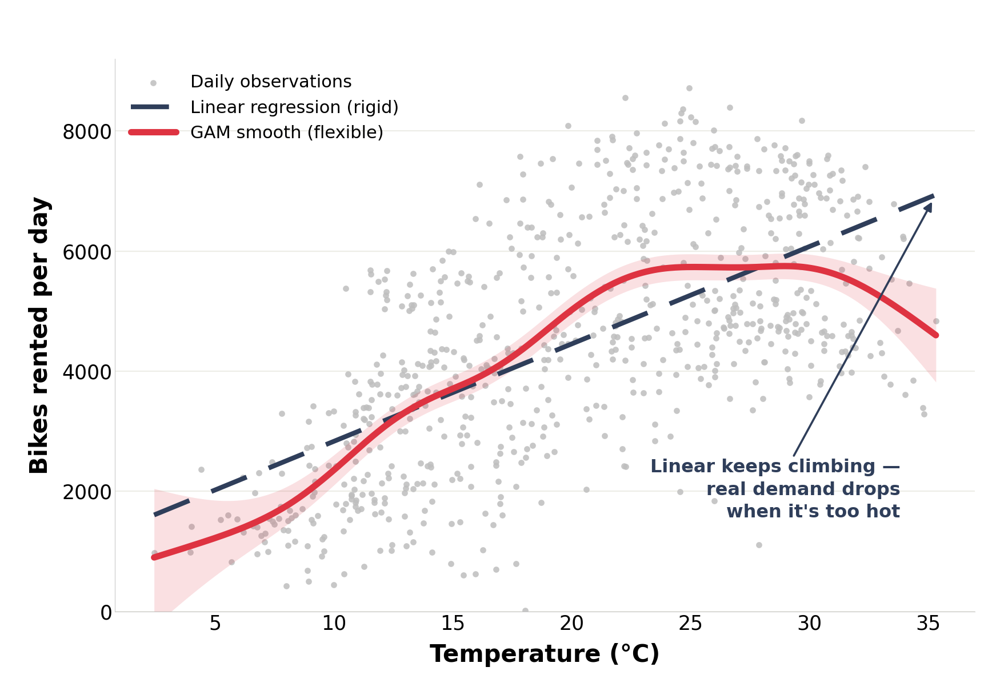
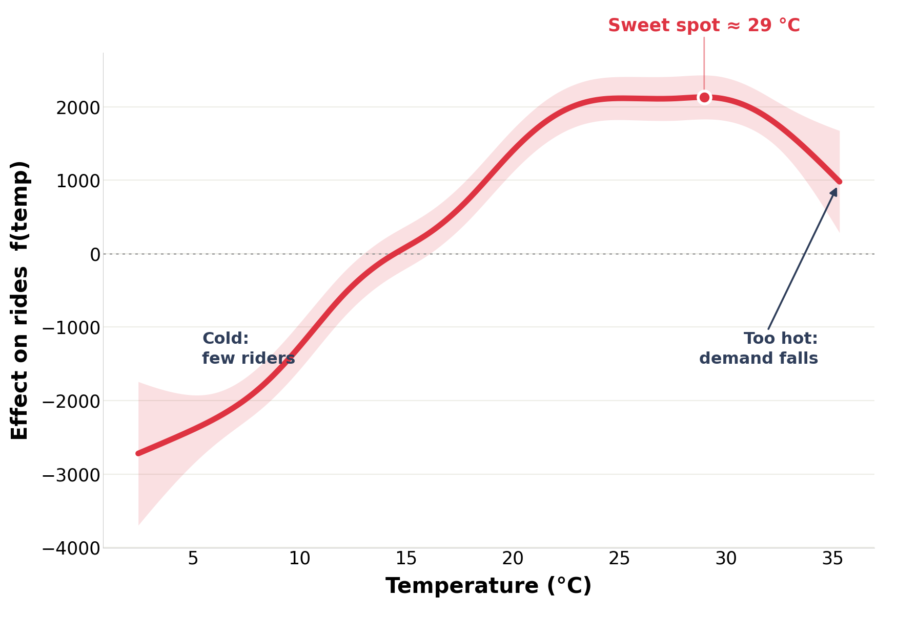
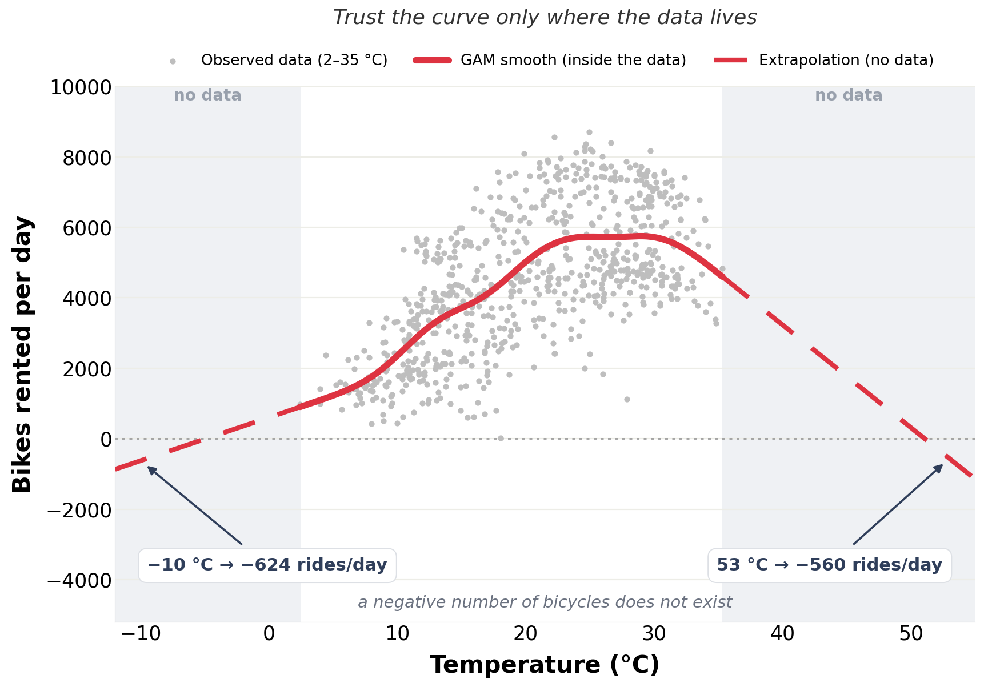

# Fitting a GAM to real bike-share demand

A worked example of a **Generalized Additive Model** on the [UCI Bike Sharing][uci]
daily dataset — 731 real days of ridership in Washington DC, 2011–2012.

The question: **how does temperature drive daily bike rentals?**

A linear model has to answer with a single slope, which forces it to claim that
hotter is always better. A GAM replaces that slope with a smooth function learned
from the data, so it can rise, turn over and fall — while staying a plottable,
one-curve-per-feature model you can explain to somebody.

## Quickstart

```bash
cd gam-bike-rentals
pip install -r requirements.txt
jupyter lab gam_bike_rentals.ipynb     # or: jupyter notebook
```

Runs in about ten seconds. The dataset downloads itself on first run and is
cached as `day.csv`; the figures are written to `figures/`.

## What comes out

### The straight line vs the curve

The linear fit must keep climbing past the point where riding stops being
pleasant. The GAM turns over instead.



### The learned effect on its own

`partial_dependence` gives the fitted smooth centred on zero — how many rides
each temperature adds or removes relative to an average day. Nobody told the
model where the peak was: no bins, no polynomial degree to guess.



### Where it breaks

A penalised spline has **linear tails**. Past the outer knots it continues the
slope it had at the edge, and nothing in the model knows that rides cannot be
negative. No warning is raised — you just get a number.



## Results

Computed by the notebook, not typed in — section 6 prints this table so you can
diff it after any change to the fit.

| quantity | value |
|---|---|
| days in dataset | 731 |
| observed range | 2.4 – 35.3 °C |
| peak temperature | 29.0 °C |
| rides at the peak | 5,749 / day |
| λ (chosen by GCV) | 15.85 |
| effective degrees of freedom | 7.51 |
| explained deviance | 47.0% |
| OLS R² for comparison | 39.4% |
| extrapolation hits zero at | −4.9 °C and 51.1 °C |
| prediction at −10 °C | −624 rides |
| prediction at 53 °C | −560 rides |

The **effective degrees of freedom** are the number to watch. A value of 1.0
would mean the smoothing penalty had flattened the curve all the way back to a
straight line — the GAM deciding it is a linear model after all. At 7.51 the
data is clearly asking for a curve.

## Notes on the implementation

- **`edge_knots`.** `pyGAM` will not evaluate outside the observed range by
  default. The extrapolation section refits with the knots set explicitly so it
  *will* — forcing that is the whole point of the third figure.
- **Units.** UCI ships the weather columns min-max scaled. The documented
  divisors are `temp / 41 °C`, `atemp / 50 °C`, `hum / 100 %`,
  `windspeed / 67 km/h`. We multiply back, because the appeal of a GAM is that
  the fitted curve reads in units a human thinks in.
- **Confidence bands** are `confidence_intervals` (uncertainty about the mean),
  not `prediction_intervals` (where an individual day might land). The latter is
  much wider and swamps the plot.
- **Download.** `archive.ics.uci.edu` rejects some automated clients, so
  `load_bikes()` tries the official zip and falls back to a GitHub mirror of the
  identical file.

## Where to take it next

- **Add terms.** `LinearGAM(s(0) + s(1) + s(2))` on temperature, humidity and
  wind lifts explained deviance from ~47% to ~60%, and each feature still gets
  its own readable curve. Worth noting: temperature's own peak shifts a couple
  of degrees cooler once humidity is in the model — hot days in DC are also
  humid, so the single-feature fit was absorbing part of that effect.
- **Add a factor.** `f(3)` handles categorical terms such as `weathersit`.
- **Interactions are not free.** The additive structure assumes each feature acts
  on its own; a genuine temperature × humidity effect needs an explicit tensor
  term, `te(0, 1)`.
- **Count data.** `PoissonGAM` is the more principled choice for ride counts and
  will not predict negative values inside the data range — though it still
  extrapolates badly outside it.

## Data

Fanaee-T, H. & Gama, J. (2013). *Event labeling combining ensemble detectors and
background knowledge*. Progress in Artificial Intelligence, 2(2–3), 113–127.
Hosted by the [UCI Machine Learning Repository][uci] under CC BY 4.0.

## License

MIT — see [LICENSE](LICENSE). The dataset carries its own license (above).

[uci]: https://archive.ics.uci.edu/dataset/275/bike+sharing+dataset
